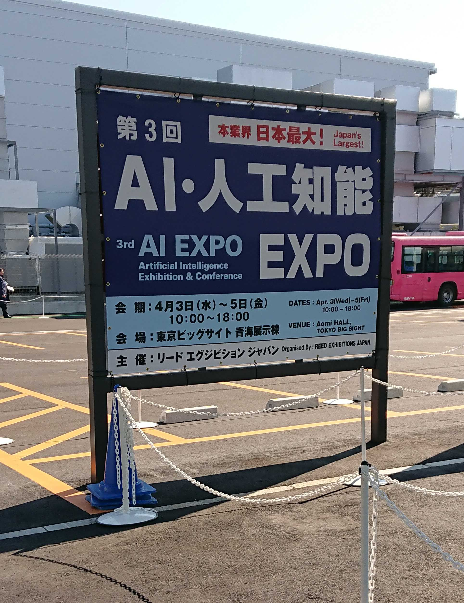

第三回AI EXPOに行ってきた。

細かい写真とかは撮っていないので、次以降の記事でもらったパンフレットとかを載せつつ、興味を持ったポイントを書いていこうと思う。

今回は全体の雑感を書こうと思う。

ポジティブな感想としては、日本でもAIが産業の世界に、どんどん浸透しているのを感じた。

第一回も第二回も行きたいと思いながら行けていないので比較のしようがないが、とはいえ、いろいろ企業が参入していて、充実していた。

大企業からベンチャー企業まで多く存在した。

電話対応のできるもの、自然なCGを作れるもの、液体を画像分析するもの…さまざまにあって楽しかった。

ただ、ネガティブな感想を書くとするなら、最先端感はなかった(商談イベントだから当然なのかもしれないが…)。

「こんなこともできるのか！！！」というものがなかった。

AIが社会に十分に普及した故にこういう感想ができると思うので、それだけ社会が進歩したのはうれしいが、もっと感動体験がほしい。

たぶん、そういう「未来」を見たい人は、論文を読む方がいいのだ。

OpenPoseを見た時の感動を忘れられない。

引用：[https://github.com/CMU-Perceptual-Computing-Lab/openpose](https://github.com/CMU-Perceptual-Computing-Lab/openpose)

ずっとKinectで人検出やっていたので、まさか普通のカメラでできるのかと思った。

***

ここまで書いて、たぶんAIに詳しい人は「OpenPoseに感動するとかレベルが低いのでは…？」と感じたのではないかと思う。

そういう人と対等に話せるくらいAIに詳しくなりたいなあ…と、ChainerやTensorFlowを頑張ってWindowsで動かして、scikit-learnを使ってSVMを遊んでいただけの人間は思うのである。

博士課程に進むなら情報理工がいいな。 
