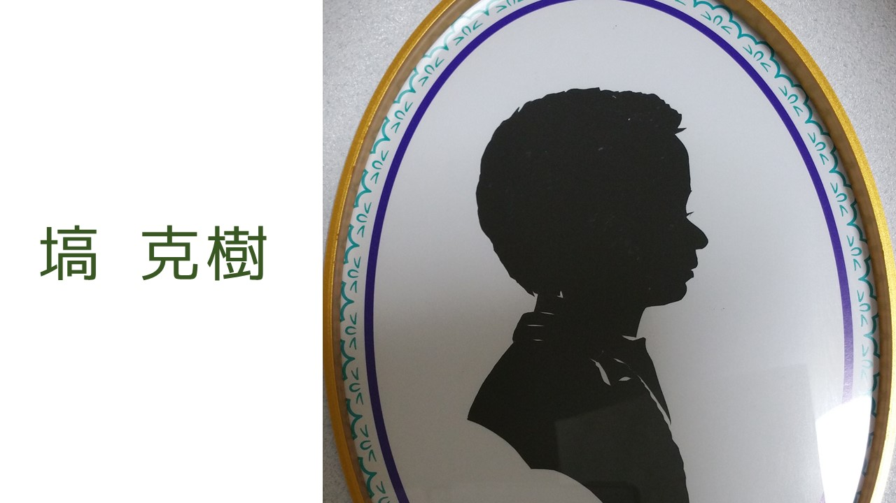

私の自己紹介をします。

だいたい[きゃりかつルーム](https://www.hanakatsuruby.me/)に書かれているんだけどね。

***

現職はエンジニアをしています。

この記事を書く直前で、現職を退職することがほぼ完全に決まりました。

今は新しい仕事はどうしようかなーと考え中です。

***

「早稲田大学 基幹理工学研究科 表現工学専攻」というところを卒業しました。

修士卒です。

大学のころは研究も含めていろいろやっていました。

研究の詳細も上記サイトにあるので詳しいものは省略しますが、磁石で絵が描ける特殊なシートに磁束密度を制御して複数枚同時に描画したり、歩きながらプログラミングができないかを検討したりしていました。

ハッカソンにも出ました。

たぶん、ハッカソンでの受賞経験がなければ、今エンジニアやっていないと思います。

やっぱり成功体験はでかいです。

今土日にハッカソン出ると、次の日からの仕事に差し支えるので出ていませんが、限られた時間で皆が物を作り、それを発表しあう場、というのは非常に良いです。

***

小学生～高校生はわりと模範的だったと思う。

せっせと勉強して、大学受験までよく頑張った。

体育はあまり得意ではなかった。

図工が大好きだった。

典型的なオタクだ。

団体行動は苦手なほうだった気もするが、コミュ障ではなかったかな。

生徒会やっていたし…。

ちょっと不思議キャラだったかもしれない。

周りに文句を言いながら、とはいえ恵まれた環境だったと思う。

そもそも中高一貫私立にぎりぎり合格だったのに、そのあと東大目指せるくらいになるんだから、むちゃくちゃ成長環境だったと思う。

[大宮開成](http://www.omiyakaisei.jp/)

入った当時あまり偏差値の高い学校ではなかった(歴史はあったけど東大に受かった人はいなかった)けど、今は東大が普通に出ているらしい。

小学校は「科学」「漫画」「ゲーム」、中学では「クラフト」「囲碁将棋」、高校では「イラスト」の部活にそれぞれ所属していた。
