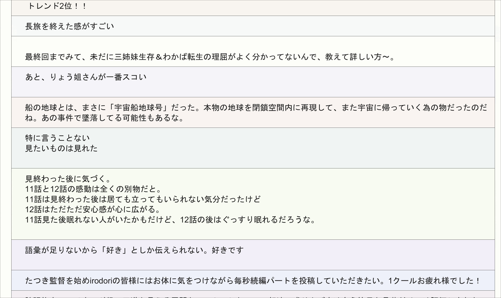

タイトルの通りツイッターのようなタイムラインを表示するのがいいのか、実際に`Processing`でタイムラインを表示(PythonでStream API叩いているんだけど、詳しいことは割愛)した。

`#ケムリクサ`で検索した。  
タイムラインが流れるの早いな…

ここでは  
* Twitter IDを表示しない
* アイコンを表示しない
* RTやいいねも出さない  

など、本当にテキストだけを表示している。

が、 **絶妙にださい** 。

当たり前だ。何の工夫もしてないから(Processingで文字がはみ出ない枠を表示させるのすげえ大変だったけど…)

これをどうすればいいか、また進捗を載せたい。

[これ](https://liginc.co.jp/web/html-css/css/115548)とか参考になりそうなんだけど、アイコンも表示しないので検討中