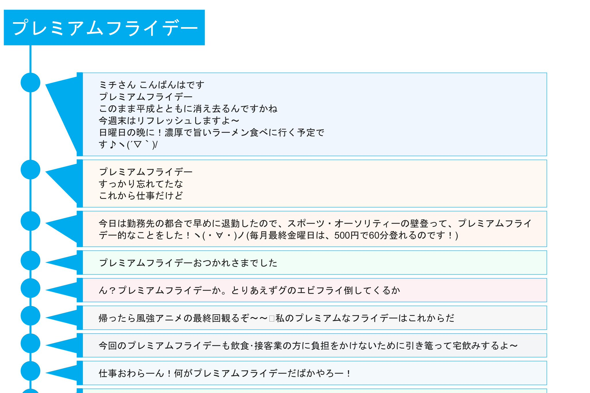

前のものより良くなっていると思う。

Twitterのリプライで友人から「アイコンの存在は大きいかも」ということを教えてくれた。

確かに、と思ったが、とある理由(そのうち告知します)でプライバシーを守るためにアイコンを表示できない。

ならとりあえず丸いものを出しておこうかなと思って表示させた。

この丸いところにツイッターの鳥を表示させたら、割と完成形態な気がする。

ここで考えているのは、"日時は付与した方がいいのか"、という問題と、"最新のツイートが一番上にあることを把握させるためにはどうしたらいいのか"、という問題だ。

最新の投稿が一番上にくるもの

* Twitter
* Instagram
* LINE(ニュース)

最新の投稿が一番下に来るもの

* LINE(トークルーム)

割と最新の投稿は一番上に来る。だから、現代人の直感とはたがわない。

ただ、なんとなくこのタイムラインはどこに最新のものがくるのかわからない。

ヘッダーがないからだろうか。

また、日時を記載した方がいいのかと考えている。

これがないと「タイムライン感」がない。時系列に何かが並んでいる感じがない。雑な羅列を感じさせる。

みたいな？
